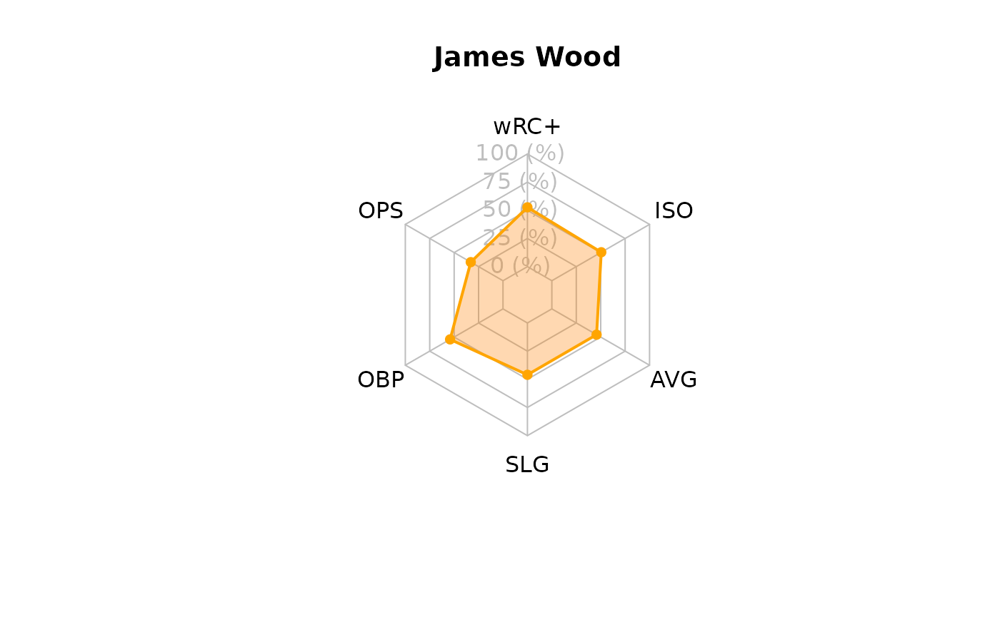

# Introduction to webgem

``` r

library(webgem)
```

## What are advanced baseball metrics and why do they matter?

A hitter’s offensive value is not based on one skill. Two players can
have similar overall production while getting there in very different
ways. One hitter may create value by reaching base often, and another
may rely on consistently hit the ball hard. `webgem` is designed to help
users compare those different parts of a hitter’s offensive profile.

`OBP`, or on-base percentage, measures how often a hitter reaches base
through hits, walks, or hit-by-pitches. A player with a strong `OBP`
helps extend innings and creates more scoring opportunities, even if
they are not always hitting for power.

`SLG`, or slugging percentage, focuses more on power. Unlike batting
average, slugging percentage gives extra credit for doubles, triples,
and home runs. This makes it useful for identifying hitters who do more
damage when they put the ball in play. A player with a high `SLG` is
usually contributing extra-base hits rather than only singles.

`OPS` (“On-Base Plus Slugging”) combines `OBP` and `SLG`, gives a quick
summary of both on-base and power, and is one of the most reliable
measured statistics used to measure a hitter’s overall offensive
production. It’s meant to combine how well a hitter can reach base, with
how well he can hit for average and for power.

`wRC+` (“Weighted Runs Created Plus”) is an advanced statistic that
essentially measures a hitter’s overall offensive value. It places
offensive production on a league-adjusted scale; a value of 100
represents league average, while a value above 100 means the hitter was
better than league average. This makes `wRC+` helpful for comparing
hitters because it adjusts for context better than a raw statistic like
`OPS`.

`ISO`, or isolated power (`ISO` = `SLG` - `BA`), is another advanced
metric that measures a hitter’s raw power by calculating how many extra
bases they average per at-bat. It isolates a player’s ability to hit for
extra bases (doubles, triples, and home runs) while completely ignoring
singles, showing whether a hitter’s production is coming from extra-base
hits.

`wOBA`, or weighted on-base average, gives different offensive events
different values. It is an advanced statistic that measures a player’s
overall offensive value by assigning different run-values to each way a
player can reach base. Instead of treating all hits equally, it properly
weighs hits and walks based on their actual contribution to scoring
runs. A single, double, triple, home run, and walk do not contribute
equally to run scoring.

`WAR`, or wins above replacement, is an advanced, all-encompassing
statistic that estimates the total number of wins a player adds to their
team compared to a freely available “replacement-level” player (e.g., a
minor leaguer or bench player). Thus, it attempts to consolidate every
facet of a player’s game (batting, base-running, fielding, and pitching)
into one quantifiable number.

Barrel percentage and hard-hit percentage describe quality of contact.
In broader terms, these specific metrics do not tend to focus on the
final result of a play, but purely how well the hitter is hitting the
ball. A high barrel percentage suggests that a player is frequently
making contact with a strong combination of exit velocity and launch
angle. A high hard-hit percentage solely suggests that the player is
consistently hitting the ball with at a high exit-velocity.

## Why use `webgem`?

While these specified baseball metrics can be exceedingly useful, they
often use different scales. For example, `wRC+`, `OPS`, `OBP`, `SLG`,
`WAR`, and barrel percentage are all useful, but they are not directly
comparable in their raw form. A `wRC+` value might be around 100, while
an `OPS` value is typically below 1.000, and barrel percentage is
measured as a percentage.

The challenge is that all of these metrics are measured differently. It
is difficult to objectively analyze the full effect of a player’s
offensive production (i.e. multiple distinct metrics) without access to
quantitative forms of comparison.

`webgem` is meant to help users compare these unique metrics.

### `metricRank()`

[`metricRank()`](https://adc-405-s26.github.io/webgem/reference/metricRank.md)
takes a numeric vector and returns category labels based on threshold
values chosen by the user, turning a numeric statistic into a more
readable category. The user can decide and label what values should as
low, middle, or high. This is useful when a user wants to classify a
statistic rather than only view the raw number, or when comparing many
players at once. A column of raw values can be difficult to scan
quickly, but a column of labels makes it easier to identify which
players fall into each performance group.

The function can be used in two ways. With one threshold, it creates two
groups. For example, a user could label every player with an `OPS` of at
least 0.800 as `"strong OPS"` and everyone below 0.800 as
`"below .800 OPS"`.

    webgem_data$ops_rank <- metricRank(
      x = webgem_data$ops,
      threshold = 0.800,
      lower_label = "below .800 OPS",
      upper_label = "strong OPS"
    )

    webgem_data[, c("player", "ops", "ops_rank")]

The function can also use two thresholds to create three groups. In this
case, values below the first threshold receive the lower label, values
between the two thresholds receive the middle label, and values at or
above the upper threshold receive the upper label.

    webgem_data$ops_group <- metricRank(
      x = webgem_data$ops,
      threshold = 0.700,
      upper_threshold = 0.850,
      lower_label = "low OPS",
      middle_label = "solid OPS",
      upper_label = "excellent OPS"
    )

    webgem_data[, c("player", "ops", "ops_group")]

Overall, instead of manually writing repeated if_else() statements each
time, the user can quickly create readable performance groups for any
numeric metric.

### `hitterProfile()`

[`hitterProfile()`](https://adc-405-s26.github.io/webgem/reference/hitterProfile.md)
creates a profile table for one hitter. The user provides a player name
and any combination of the supported hitting metrics. The function
ignores metrics that are not provided, so the user does not need to fill
in every argument.

For example, a user can select one player from webgem_data and pass that
player’s statistics into
[`hitterProfile()`](https://adc-405-s26.github.io/webgem/reference/hitterProfile.md).

    player_data <- webgem_data[webgem_data$player == "Shohei Ohtani", ]

    ohtani_profile <- hitterProfile(
      player = player_data$player,
      wrc_plus = player_data$wrc_plus,
      ops = player_data$ops,
      obp = player_data$obp,
      slg = player_data$slg,
      avg = player_data$avg,
      iso = player_data$iso,
      war = player_data$war,
      woba = player_data$woba,
      bb_pct = player_data$bb_pct,
      barrel_pct = player_data$barrel_pct,
      hard_hit_pct = player_data$hard_hit_pct
    )

    ohtani_profile

    #>   metric raw_value scaled_value        player
    #> 1   wRC+   151.000     67.33333 Shohei Ohtani
    #> 2    OPS     0.709     15.57143 Shohei Ohtani
    #> 3    OBP     0.335     49.23077 Shohei Ohtani
    #> 4    SLG     0.374     24.80000 Shohei Ohtani
    #> 5    AVG     0.246     42.66667 Shohei Ohtani
    #> 6    ISO     0.128     22.28571 Shohei Ohtani

The output is a data frame with the metric name, the original raw value,
the scaled value, and the player name. The raw_value column keeps the
original baseball statistic. The scaled_value column converts each
metric to a 0–100 scale so the metrics can be compared more easily.

This function is useful because it prepares the data for comparison and
plotting. A user can create a smaller profile with only a few metrics or
a fuller profile with many metrics, depending on what they want to
examine.

### `hitterRadar()`

hitterRadar() takes the profile data created by hitterProfile() and
turns it into a radar plot. Because the radar plot uses the scaled_value
column, the metrics are shown on the same 0–100 scale.

The function expects a data frame with at least three important columns:
metric, scaled_value, and player. These columns are automatically
created by hitterProfile(), so the easiest workflow is to create a
profile first and then pass that profile directly into hitterRadar().

The radar plot helps the user see the shape of a player’s offensive
profile. Metrics farther from the center represent higher scaled values.
This makes it easier to notice whether a hitter is strongest in power,
on-base ability, overall production, or quality of contact.

A typical workflow is:

``` r

player_data <- webgem_data[webgem_data$player == "James Wood", ]

profile <- hitterProfile(
  player = player_data$player,
  wrc_plus = player_data$wrc_plus,
  ops = player_data$ops,
  obp = player_data$obp,
  slg = player_data$slg,
  avg = player_data$avg,
  iso = player_data$iso,
)

hitterRadar(profile)
```



[`hitterProfile()`](https://adc-405-s26.github.io/webgem/reference/hitterProfile.md)
organizes and scales the statistics, and
[`hitterRadar()`](https://adc-405-s26.github.io/webgem/reference/hitterRadar.md)
visualizes the scaled profile.
