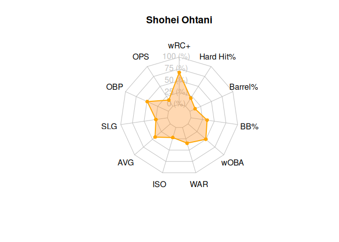

# webgem

The goal of webgem is to make baseball hitting metrics easier to
interpret by ranking, scaling, and visualizing player statistics.

## Installation

You can install the development version of webgem from
[GitHub](https://github.com/) with:

``` r

# install.packages("remotes")
# install.packages("devtools")
devtools::install_github("ADC-405-S26/webgem")
```

## Examples

This is a basic example which shows you how to solve a common problem:

``` r

library(webgem)
```

#### metricRank Example

``` r

metricRank(
  x = webgem_data$ops,
  threshold = 0.8,
  lower_label = "mediocre ops",
  upper_label = "great ops"
)
#>  [1] "mediocre ops" "great ops"    "mediocre ops" "great ops"    "mediocre ops"
#>  [6] "mediocre ops" "mediocre ops" "mediocre ops" "mediocre ops" "mediocre ops"
#> [11] "mediocre ops" "mediocre ops" "great ops"    "mediocre ops" "great ops"   
#> [16] "mediocre ops" "great ops"    "mediocre ops" "great ops"    "great ops"   
#> [21] "great ops"    "mediocre ops" "mediocre ops" "mediocre ops" "great ops"
```

#### hitterProfile Example

``` r

player_data <- webgem_data[webgem_data$player == "Shohei Ohtani", ]

ohtani_profile <- hitterProfile(
  player = player_data$player,
  wrc_plus = player_data$wrc_plus,
  ops = player_data$ops,
  obp = player_data$obp,
  slg = player_data$slg,
  avg = player_data$avg,
  iso = player_data$iso,
  war = player_data$war,
  woba = player_data$woba,
  bb_pct = player_data$bb_pct,
  barrel_pct = player_data$barrel_pct,
  hard_hit_pct = player_data$hard_hit_pct
)

ohtani_profile
#>       metric raw_value scaled_value        player
#> 1       wRC+   151.000     67.33333 Shohei Ohtani
#> 2        OPS     0.709     15.57143 Shohei Ohtani
#> 3        OBP     0.335     49.23077 Shohei Ohtani
#> 4        SLG     0.374     24.80000 Shohei Ohtani
#> 5        AVG     0.246     42.66667 Shohei Ohtani
#> 6        ISO     0.128     22.28571 Shohei Ohtani
#> 7        WAR     5.200     34.66667 Shohei Ohtani
#> 8       wOBA     0.324     49.60000 Shohei Ohtani
#> 9        BB%     8.900     34.70588 Shohei Ohtani
#> 10   Barrel%     4.800     12.17391 Shohei Ohtani
#> 11 Hard Hit%    28.100     20.25000 Shohei Ohtani
```

#### hitterRadar Example

``` r

hitterRadar(ohtani_profile)
```


